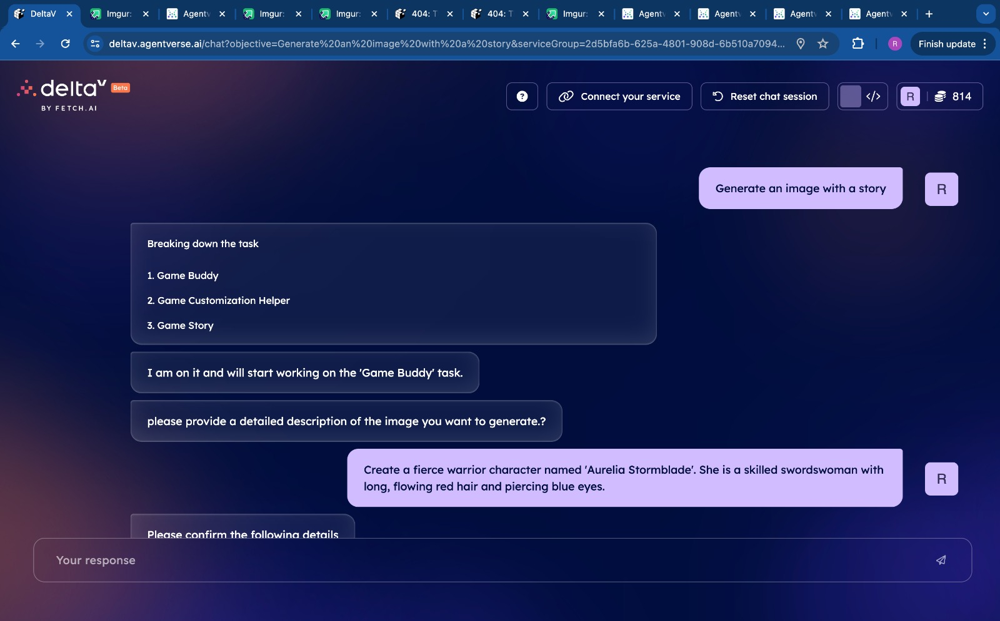
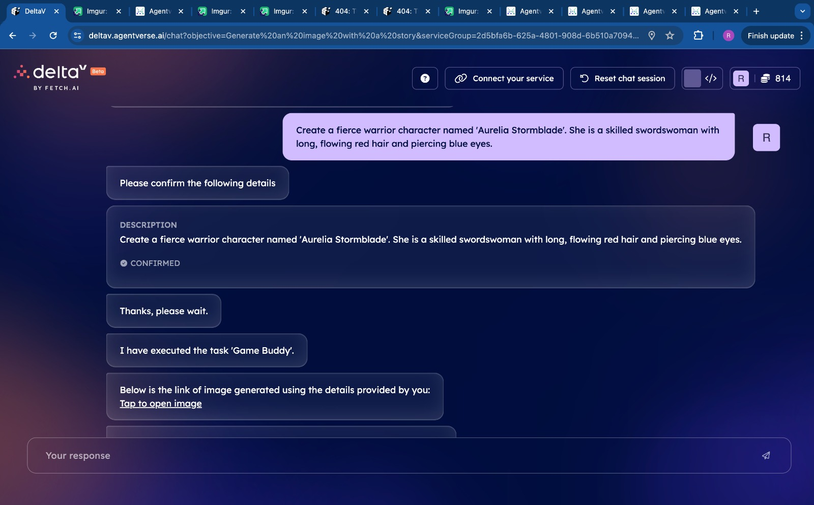
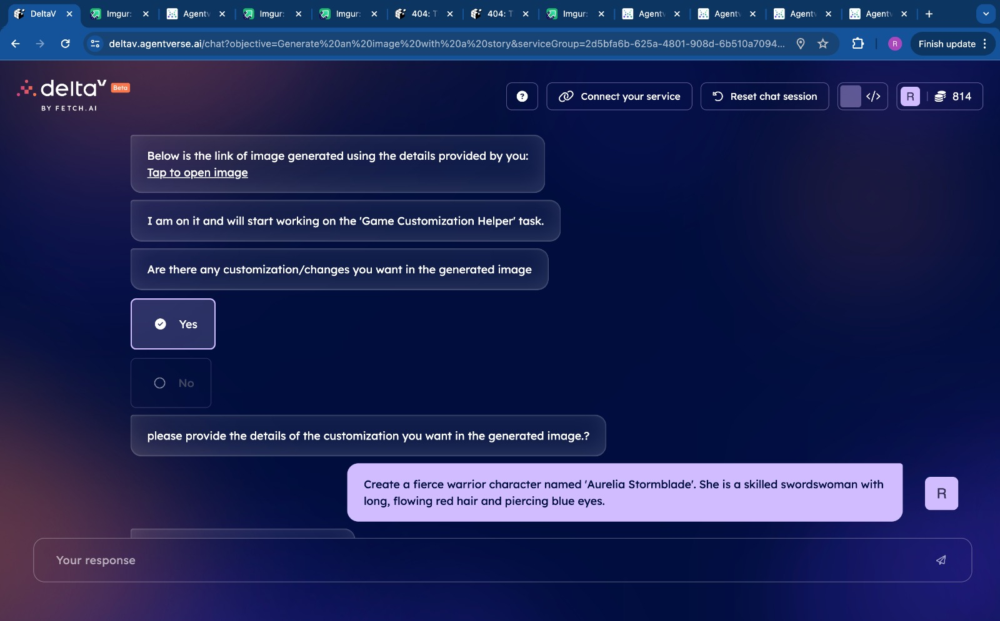
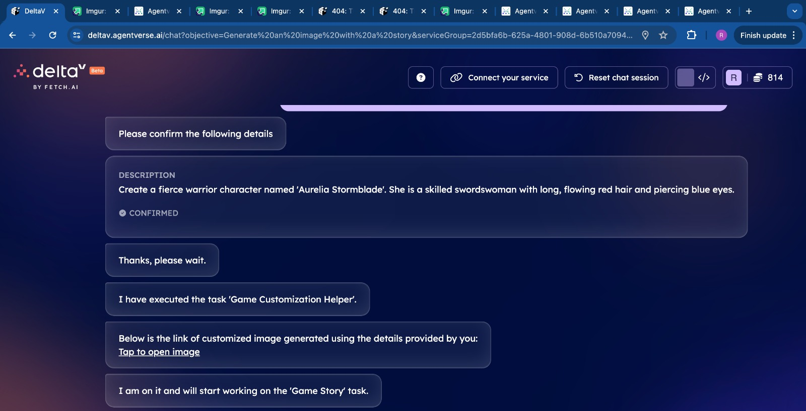
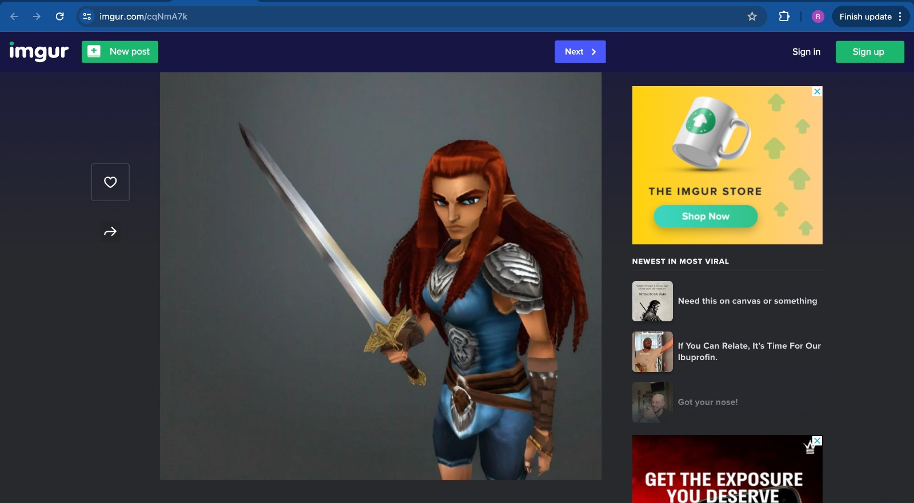

# Game Buddy

## Description
Game Buddy is a text-to-image generator program that utilizes the `ps1-graphics-sdxl-v2` model from Hugging Face to generate visual representations based on user-provided text input. The program allows users to:

- **Generate Images**: Game Buddy takes text input from the user and generates an image using the `ps1-graphics-sdxl-v2` model.
  
- **Edit Prompts/Input**: Users can edit the generated prompt or input to refine the image generation process.
  
- **Request Image Story**: Additionally, Game Buddy offers the option to provide a story related to the generated image. The story is generated using the `gemma-7b` text generation model.

## Business Model
Game Buddy can be leveraged as a service for generating custom images and associated stories based on user inputs. Potential business models include:
- **Subscription Service**: Offer different tiers of access for varying usage limits.
- **Pay-per-Use**: Charge users based on the number of image generations and story requests.
- **API Integration**: Allow other applications to integrate image and story generation as a service.

## Agents Used in our Project

### UAgentResponse
- **Description**: Handles formatting and sending messages containing image URLs and generated stories back to users.

### Context
- **Description**: Manages and controls agent interactions and responses within the application.

## Tech Stack Used
- **Python**: Programming language used for the project.
- **Hugging Face**: API used for image generation (`ps1-graphics-sdxl-v2`) and text generation (`Gemini`).
- **Imgur API**: Used for image hosting and retrieval.
- **Pydantic**: Used for data validation and modeling.
- **Requests**: Used for making HTTP requests to external APIs.

---

## Screenshots

